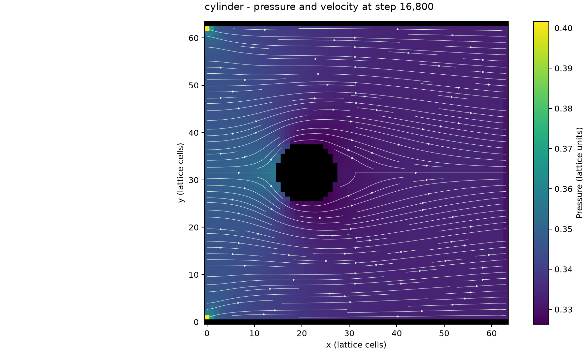

# NavierStokes

A D2Q9 (2 dimension with 9 population states per cell) lattice Boltzmann fluid solver with a fused CUDA collision and streaming
kernel, launched from Python through CuPy. The project explores flow around
different obstacles in a two-dimensional channel. It's super cool :)

**[Interactive flow viewer](https://william27b.github.io/NavierStokes/)**

The gallery displays saved pressure fields in viridis, solid boundaries in black,
and particles moving through the saved velocity field. It includes geometry
selection and adjustable particle speed and count.

## Simulation

Eight geometries are included: an open channel, cylinder, rectangle, ellipse,
diamond, two cylinders, staggered cylinders, and a constriction.

The solver applies an inlet and outlet velocity to simulate fluid flow around
different 2D obstacles. It will end early if it has converged

The default configuration uses a 64 x 64 grid, a relaxation time of `tau=0.8`, an
inlet velocity of `(0.1, 0.0)`, and a limit of 100,000 steps.

Simulation requires an NVIDIA CUDA GPU, CuPy, NumPy, and Matplotlib. The saved
results can be viewed in a browser without a GPU, or the default results are attached
in the interactive flow viewer above.

## Saved results

Each run archive contains numerical fields, plots, metadata, an offline viewer,
and a standalone Python snapshot with the kernel and geometry functions embedded.
The public gallery includes pressure, velocity, solid masks, selected simulation
metadata, and preview plots.

[Solver documentation](D2Q9/SOLVER_RUNS.md) describes the configuration options
and saved-file formats.

## Project files

| Path | Purpose |
| --- | --- |
| [D2Q9/solver.py](D2Q9/solver.py) | Simulation file |
| [D2Q9/kernel.cpp](D2Q9/kernel.cpp) | D2Q9 CUDA kernel |
| [D2Q9/solids.py](D2Q9/solids.py) | Geometry functions returning solid masks |
| [D2Q9/run_solids.py](D2Q9/run_solids.py) | Runs `solver.py` in batches |
| [D2Q9/flow_viewer.py](D2Q9/flow_viewer.py) | Local webpage server |
| [D2Q9/export_viewer.py](D2Q9/export_viewer.py) | Static webpage export |
| `docs/` | Webpage, display data, and previews |
| `12_steps_to_navier_stokes/` | Other CFD exercises from [12 Steps to Navier Stokes](https://lorenabarba.com/blog/cfd-python-12-steps-to-navier-stokes/) |
